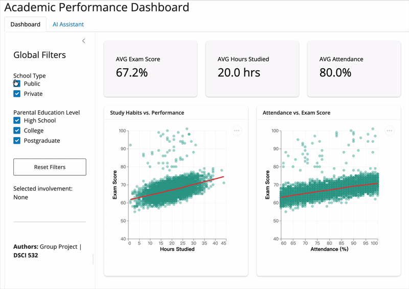

# DSCI-532_2026_36_academic-performance

# Academic Performance Dashboard

## Live App

- **Stable Release (main):** https://mkmetiuk-dsci-532-2026-36-academic-performance.share.connect.posit.cloud
- **Preview Build (dev):** https://mkmetiuk-dev.share.connect.posit.cloud

---

## Demo



---

## Overview

This project develops an interactive dashboard using **Shiny for Python** to explore factors associated with student academic performance.

The dashboard supports:

- Filtering students by **School Type** and **Parental Education Level**
- Viewing real-time KPI summaries:
  - Average Exam Score
  - Average Hours Studied
  - Average Attendance
- Exploring relationships between:
  - Study habits and exam performance (scatter + LOESS)
  - Family income and score distribution (boxplot)
  - Parental involvement and average performance (bar chart)

The goal is to support data-driven educational decision-making for school administrators and families. The dashboard is publicly deployed on Posit Connect Cloud.

---

## Installation (for contributors)

```bash
git clone https://github.com/UBC-MDS/DSCI-532_2026_36_academic-performance.git
cd DSCI-532_2026_36_academic-performance

conda env create -f environment.yml
conda activate dsci-532-m1

cd src
shiny run app.py
```

## Project Structure

```text
DSCI-532_2026_36_academic-performance/
├── src/              # Shiny application (app.py)
├── data/             # Dataset
├── notebooks/        # EDA
├── reports/          # M1 & M2 documents
├── img/              # Sketch + demo animation
├── CHANGELOG.md
└── README.md
```

## Milestone 2 Status

- Functional dashboard prototype implemented  
- Shared reactive architecture  
- Deployed to Posit Connect Cloud (main + dev)  
- Documentation updated  
- Release v0.2.0 prepared