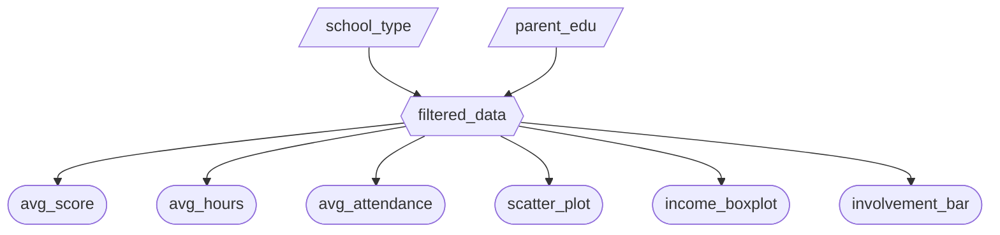

# Milestone 2 Specification

## 2.1 Updated Job Stories

| # | Job Story | Status | Notes |
|---|-----------|--------|-------|
| 1 | When I filter students by school context (e.g., school type, parental education level), I want the dashboard to update automatically so I can explore performance patterns across groups. | ✅ Implemented | Implemented via global filters + shared reactive filtered_data |
| 2 | When reviewing overall performance, I want quick KPI-style summaries so I can get an immediate sense of the selected group. | ✅ Implemented | AVG Exam Score / AVG Hours Studied / AVG Attendance value boxes |
| 3 | When exploring study effort, I want to see how hours studied relates to exam score so I can understand trends and potential intervention targets. | ✅ Implemented | Scatter plot with LOESS trend line |
| 4 | When comparing family context factors, I want to compare score distributions/averages across categories so I can identify gaps. | ✅ Implemented | Income boxplot + parental involvement bar chart |

---

## 2.2 Component Inventory

| ID | Type | Shiny widget / renderer | Depends on | Job story |
|----|------|--------------------------|------------|-----------|
| school_type | Input | `ui.input_checkbox_group()` | — | #1 |
| parent_edu | Input | `ui.input_select(..., multiple=True)` | — | #1 |
| filtered_data | Reactive calc | `@reactive.calc` | school_type, parent_edu | #1 |
| avg_score | Output | `@render.text` | filtered_data | #2 |
| avg_hours | Output | `@render.text` | filtered_data | #2 |
| avg_attendance | Output | `@render.text` | filtered_data | #2 |
| scatter_plot | Output | `@render_widget` (Altair) | filtered_data | #3 |
| income_boxplot | Output | `@render_widget` (Altair) | filtered_data | #4 |
| involvement_bar | Output | `@render_widget` (Altair) | filtered_data | #4 |

---

## 2.3 Reactivity Diagram

Yes, the diagram satisfies the reactivity requirements in Phase 3.2. `filtered_df` depends on two inputs (`input_school_type` and `input_parent_edu`). All of the outputs consume the same `@reactive.calc`, and each input change triggers the calculation once.

---

## 2.4 Calculation Details

### `filtered_data` (`@reactive.calc`)

- **Inputs:** `school_type`, `parent_edu`
- **Transformation:**  
  Filters rows of the dataset to only include students where  
  `School_Type` is within the selected school types **and**  
  `Parental_Education_Level` is within the selected parental education levels.  
  If either input is empty, the function returns an empty dataframe to prevent rendering errors.

- **Consumed by outputs:**  
  `avg_score`, `avg_hours`, `avg_attendance`,  
  `scatter_plot`, `income_boxplot`, `involvement_bar`
