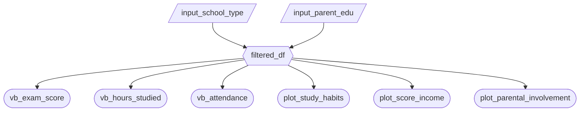

### 2.1 Updated Job Stories

| # | Job Story | Status | Notes |
|---|-----------|--------|-------|
| 1 | When I open the dashboard, I want to visualize the differences in exam score distributions between private and public schools, so I can allocate the limited funds effectively. | ✅ Implemented |  |
| 2 | When I am evaluating whether my tutoring programs are working, I want to compare performance outcomes across tutoring levels and student backgrounds, so I can justify expanding or restructuring support programs. | ⏳ Pending M3 |  |
| 3 | When I support my child at home, I want to understand whether factors like the number of hours studied, parental involvement, sleep, lifestyle, etc. are associated with exam performance, so I can prioritize the most impactful changes and become involved in my child's education in the best way possible. | ⏳ Pending M3 |  |
| 4 | When I invest in my child's education, I want to compare the relative influence of tutoring versus healthy routines, so I can make cost-effective and data driven parenting decisions. | ⏳ Pending M3 | |

### 2.2 Component Inventory

| ID            | Type          | Shiny widget / renderer | Depends on                   | Job story  |
| ------------- | ------------- | ----------------------- | ---------------------------- | ---------- |
| `input_school_type`           | Input         | `ui.input_checkbox_group()` | —  | #1, #3       |
| `input_parent_edu`            | Input         | `ui.input_select()`         | —  | #2       |
| `filtered_df`                 | Reactive calc | `@reactive.calc`            |`input_school_type`,`input_parent_edu`| #..       |
| `vb_exam_score`               | Output        | `@render.text`              | `filtered_df`| #..       |
| `vb_hours_studied`            | Output        | `@render.text`              | `filtered_df`| #..       |
| `vb_attendance`               | Output        | `@render.text`              | `filtered_df`| #..       |
| `plot_study_habits`           | Output        | `@render.plot`              | `filtered_df`| #..       |
| `plot_score_income`           | Output        | `@render.plot`              | `filtered_df`| #..       |
| `plot_parental_involvement`   | Output        | `@render.plot`              | `filtered_df`| #..       |

**Total Components:** 9

### 2.3 Reactivity Diagram

Verify your diagram satisfies the reactivity requirements in Phase 3.2 before you start coding.

### 2.4 Calculation Details
**`filtered_df`** (`@reactive.calc`)

- **Depends on:** `input_school_type`, `input_parent_edu`
- **Transformation:** Starts from the cleaned dataset df

    If filters have no selections, returns an empty DataFrame.

    Otherwise filters rows to keep observations where:
    - School_Type is in the selected school types
    - Parental_Education_Level is in the selected parent education levels

    Returns a copy of the filtered data frame.

- **Consumed by:** `vb_exam_score`, `vb_hours_studied`, `vb_attendance`, `plot_study_habits`, `plot_score_income`, and `plot_parental_involvement` 
