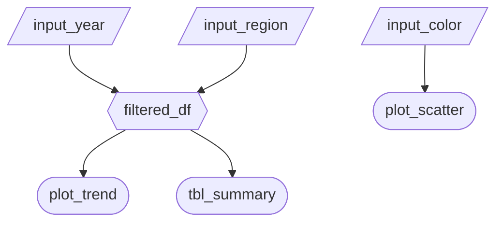

### 2.1 Updated Job Stories

| # | Job Story | Status | Notes |
|---|-----------|--------|-------|
| 1 | When I plan academic support budgets, I want to identify which student segments are doing poorly and why, so I can allocate limited school resources effectively. | ... | ... |
| 2 | When I am evaluating whether my tutoring programs are working, I want to compare performance outcomes across tutoring levels and student backgrounds, so I can justify expanding or restructuring support programs. | ... | ... |
| 3 | When I support my child at home, I want to understand whether sleep and lifestyle factors are associated with exam performance, so I can prioritize the most impactful changes. | ⏳ Pending M3 | ... |
| 4 | When I invest in my child's education, I want to compare the relative influence of tutoring versus healthy routines, so I can make cost-effective and data driven parenting decisions. | ⏳ Pending M3 | ... |

### 2.2 Component Inventory

| ID            | Type          | Shiny widget / renderer | Depends on                   | Job story  |
| ------------- | ------------- | ----------------------- | ---------------------------- | ---------- |
| `input_school_type`           | Input         | `ui.input_checkbox_group()` | —  | #..       |
| `input_parent_edu`            | Input         | `ui.input_select()`         | —  | #..       |
| `filtered_df`                 | Reactive calc | `@reactive.calc`            |`input_school_type`,`input_parent_edu`| #..       |
| `vb_exam_score`               | Output        | `@render.text`              | `filtered_df`| #..       |
| `vb_hours_studied`            | Output        | `@render.text`              | `filtered_df`| #..       |
| `vb_attendance`               | Output        | `@render.text`              | `filtered_df`| #..       |
| `plot_study_habits`           | Output        | `@render.plot`              | `filtered_df`| #..       |
| `plot_score_income`           | Output        | `@render.plot`              | `filtered_df`| #..       |
| `plot_parental_involvement`   | Output        | `@render.plot`              | `filtered_df`| #..       |

**Total Components:** 9

### 2.3 Reactivity Diagram

Draw your planned reactive graph as a [Mermaid](https://mermaid.js.org/) flowchart using the notation from Lecture 3:

- `[/Input/]` (Parallelogram) (or `[Input]` Rectangle) = reactive input
- Hexagon `{{Name}}` = `@reactive.calc` expression
- Stadium `([Name])` (or Circle) = rendered output

Example:

````markdown

````

Verify your diagram satisfies the reactivity requirements in Phase 3.2 before you start coding.

### 2.4 Calculation Details
For each `@reactive.calc` in your diagram, briefly describe:

- Which inputs it depends on.
- What transformation it performs (e.g., "filters rows to the selected year range and region(s)").
- Which outputs consume it.
